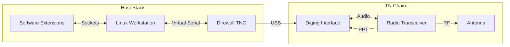

# Amatuer Radio Theory

## Flowcharts

## End-to-End Signal Flow

The flowchart shows every stage a message passes through—from the moment a user types a command to the instant RF energy leaves the antenna. This section expands every acronym and makes the relationships explicit so even someone new to packet radio can follow the data path.

### Protocol & Device Primer (Plain Language)
- **Telnet (TCP port 8100):** A very simple text chat between two computers. Anything you type in a Telnet window is sent down a TCP/IP socket to LinBPQ, which reacts in real time. No encryption, no graphics—just ASCII text.
- **HTTP (TCP port 8080):** The protocol browsers speak. LinBPQ’s optional dashboard is just a small web site that serves HTML status pages over HTTP.
- **Pseudo-serial link (PTY):** Linux lets software pretend to be a serial cable. LinBPQ opens `/dev/pts/*` devices that behave exactly like wires leading to a physical modem, even though they exist only in RAM.
- **KISS (Keep It Simple, Stupid):** A lightweight envelope. LinBPQ puts each AX.25 packet into a KISS “envelope” so it can deliver it reliably to Direwolf over TCP. Direwolf removes the envelope before modulation.
- **AX.25:** The amateur-radio data-link standard. It defines how call signs, digipeaters, acknowledgements, and retries work over RF. Every RF frame on your node is AX.25 inside.
- **PCM / AFSK:** PCM is raw, uncompressed audio; AFSK (Audio Frequency Shift Keying) is the method of encoding 1s and 0s as audio tones. Direwolf takes AX.25 bits, produces AFSK tones, and plays them as PCM audio through the sound card.
- **PTT (Push-To-Talk):** A simple line that goes high to make the radio transmit and low to let it listen. Digirig’s USB-to-serial chip toggles this line on behalf of Direwolf.
- **Direwolf:** A software modem and TNC combined. It accepts KISS frames from LinBPQ, generates AFSK audio for the radio, and also listens to incoming audio, decoding it back to AX.25 frames.
- **Digirig:** A USB interface that bundles a sound card (for audio), an isolated keying circuit (for PTT), and optional CAT control. It connects your computer to the radio’s accessory jack safely and with low noise.

### 1. Host Stack — How Data Enters the System
1. **User connects via Telnet/HTTP/local console.** Their keyboard input becomes TCP packets headed to the Linux workstation.
2. **Linux kernel delivers the TCP packets** to LinBPQ. No radio yet—just ordinary networking.
3. **LinBPQ interprets the commands** (BBS message, node connect, chat, etc.) and decides what to do next. Regardless of origin, LinBPQ stores the payload as an AX.25 frame internally because that is the format used on RF.
4. **If the destination is another RF node,** LinBPQ wraps the AX.25 frame inside KISS bytes and pushes it across a TCP socket to Direwolf (`127.0.0.1:8001`).
5. **If the destination is another Telnet/HTTP session,** the frame never leaves the computer; LinBPQ simply sends a response back down the existing TCP connection.

### 2. Direwolf + Digirig — Digital-to-Audio Conversion
1. **Direwolf receives the KISS frame** and strips off the KISS start/stop bytes. What remains is a pure AX.25 frame with source/destination call signs, control bits, and the payload.
2. **Direwolf modulates the frame** using AFSK at 1200 baud (two tones, 1200 Hz and 2200 Hz). The tones are output as PCM audio samples to the sound card provided by the Digirig.
3. **Digirig passes the audio** into the radio’s mic/data input. At the same time Direwolf tells Digirig to assert the **PTT line**, keying the transmitter so the tones actually go out over the air.

### 3. RF Chain — Over-the-Air Transmission
1. **Radio transceiver** converts the audio tones to RF on the configured frequency (e.g., 439.100 MHz). This is standard FM modulation; the radio does not “know” anything about AX.25.
2. **Antenna** radiates the RF energy. Feedline loss, antenna gain, and surroundings dictate how far the signal travels. On receive, the antenna collects incoming RF and feeds it back into the radio, which demodulates it into audio.

### 4. Receive Path — Coming Back the Other Way
1. An external station transmits AX.25 frames. Your **antenna and radio** convert them back into audio and send them to the Digirig.
2. **Digirig** delivers the audio as PCM samples to Direwolf, while PTT remains off (the radio is in receive mode).
3. **Direwolf** detects the familiar 1200/2200 Hz tones, demodulates them into AX.25 bits, wraps them in KISS, and ships them to LinBPQ across the TCP socket.
4. **LinBPQ** decodes the AX.25 headers to learn who the frame is for, decides whether to respond locally (BBS, CHAT) or forward via another port, and then takes the appropriate action.

### 5. Coordination & Timing
- **`IDINTERVAL`** ensures legal station identification every N minutes.
- **`BTINTERVAL`** limits how often beacon text is broadcast so the channel is not flooded.
- **`RESPTIME`** and other ACK timers control how long LinBPQ waits before retrying packets, keeping shared frequencies polite.

### Putting It All Together
1. User types `CONNECT BBS` over Telnet → TCP packet → LinBPQ → KISS → Direwolf → audio → Digirig → RF → remote node.
2. Remote node replies → RF → Digirig → audio → Direwolf → KISS → LinBPQ → Telnet socket → user screen.
3. Every hop involves well-defined layers (Application → AX.25 → KISS → PCM → RF and back). If the path breaks, check each layer in order.

When debugging, follow the stack from the user outward: Telnet client (TCP) → LinBPQ logs → KISS link (`netstat -an | grep 8001`) → Direwolf console output → Digirig cables/PTT indicators → radio → antenna. Knowing precisely what each protocol/device does makes it much easier to isolate the fault.