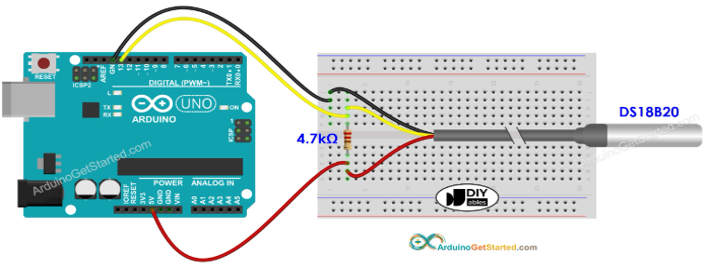

# DS18B20 Temperature Sensor Setup

The DS18B20 is a digital 1-Wire temperature sensor that delivers accurate readings from -55 °C to +125 °C using only one data line. The notes below walk through the wiring, required Arduino libraries, and a sample sketch that streams readings to the Serial Monitor every 0.5 seconds.

## Hardware Overview

### Pinout

| DS18B20 Pin | Function          | Connect to on Arduino |
|-------------|-------------------|-----------------------|
| VCC         | 3.0–5.5 V supply  | 5 V (or 3.3 V if using a 3.3 V board) |
| GND         | Ground            | GND                   |
| DQ          | Data line         | Any digital pin (example uses `D2`) |


<figure markdown="span">
        { width="200", align="left" }
        <figcaption>Figure 1: DS18B20 pins</figcaption>
</figure>


!!! note
    Keep a 4.7 kΩ pull-up resistor between `DQ` and `VCC`. Without it the sensor will intermittently report `-127 °C` or `85 °C` because the 1-Wire bus floats.

### Wiring Steps
1. Place the DS18B20 so you can identify the flat face—pins read left to right as `VCC`, `DQ`, `GND`.
2. Connect `VCC` of DS18B20 to the Arduino 5 V pin (or 3.3 V on 3.3 V boards) and `GND` to Arduino GND.
3. Connect `DQ` of DS18B20 to digital pin `D13` (change the pin in the sketch if you use a different one).
4. Insert a 4.7 kΩ resistor between `DQ` and `VCC` as close to the sensor as possible.

<figure markdown="span">
        { width="1000" }
        <figcaption>Figure 2: Example wiring for a 5 V Arduino and DS18B20 temperature sensor with a pull-up resistor on the data line.</figcaption>
</figure>

## Software Setup

### Install Required Libraries
Follow the following steps to install `DallasTemperature` and `OneWire`

1. Open the Arduino IDE.
2. Navigate to `Sketch → Include Library → Manage Libraries…`.
3. Search for **DallasTemperature**.
4. Select version **3.9.0** and click **Install**. Accept the prompt to install the dependency **OneWire**.

### Example Sketch
Create a new sketch and paste the code below. Change `ONE_WIRE_BUS` if you wired the sensor to a different digital pin.

=== "C++"
```cpp
/*
 * Created by ArduinoGetStarted.com
 *
 * This example code is in the public domain
 *
 * Tutorial page: https://arduinogetstarted.com/tutorials/arduino-temperature-sensor
 */
#include <OneWire.h>
#include <DallasTemperature.h>
const int SENSOR_PIN = 13; // Arduino pin connected to DS18B20 sensor's DQ pin
OneWire oneWire(SENSOR_PIN);         // setup a oneWire instance
DallasTemperature tempSensor(&oneWire); // pass oneWire to DallasTemperature library
float tempCelsius;    // temperature in Celsius
float tempFahrenheit; // temperature in Fahrenheit
void setup()
{
  Serial.begin(9600); // initialize serial
  tempSensor.begin();    // initialize the sensor
}
void loop()
{
  tempSensor.requestTemperatures();             // send the command to get temperatures
  tempCelsius = tempSensor.getTempCByIndex(0);  // read temperature in Celsius
  tempFahrenheit = tempCelsius * 9 / 5 + 32; // convert Celsius to Fahrenheit
  Serial.print("Temperature: ");
  Serial.print(tempCelsius);    // print the temperature in Celsius
  Serial.print("°C");
  Serial.print("  ~  ");        // separator between Celsius and Fahrenheit
  Serial.print(tempFahrenheit); // print the temperature in Fahrenheit
  Serial.println("°F");
  delay(500);
}
```

## Reading Temperature Using the Serial Monitor
1. Connect the Arduino over USB and select the board/port under `Tools → Board` and `Tools → Port`.
2. Upload the sketch (`Sketch → Upload`).
3. Open `Tools → Serial Monitor`, set the baud rate to **9600**, and observe the temperature updates every 500 ms.
4. Dip the probe in hot/cold water or pinch it between your fingers—the displayed value should track the change within a second.

## Troubleshooting
- **Reading stays at -127 °C or 85 °C** – The sensor is not detected. Re-check the pull-up resistor, cable continuity, and pin assignments.
- **Serial Monitor is blank** – Make sure the baud rate is 9600 and that the correct USB/serial port is selected.
- **Values jump erratically** – Use shorter leads, add shielding/ground, or move the pull-up resistor closer to the sensor to clean up the 1-Wire bus.
- **Upload fails** – Close other serial terminals and confirm the board/port settings.

## Reference
* [Arduino Get Started - DS18B20 Temperature Sensor](https://arduinogetstarted.com/tutorials/arduino-temperature-sensor)
