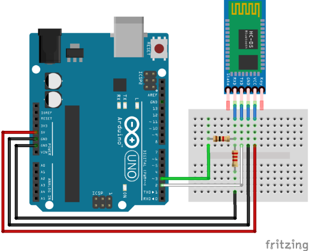

# HC-05 Bluetooth Module Setup

Connect an HC-05 classic Bluetooth module to an Arduino, pair it with Lubuntu, and stream serial temperature data from DS18B20 over the wireless link.

## Hardware Setup
HC-05 logic pins expect 3.3 V. When using a 5 V Arduino, level-shift the Arduino TX line (going into HC-05 RX) with a simple voltage divider (e.g., 1.8 kΩ + 3.3 kΩ) is required. Alternatively, bi-directional logic level converter can be used to convert 5V and 3.3V logic.

**Wiring (Arduino Uno example)**

- HC-05 `TXD` → Arduino `pin 2` (software RX)
- HC-05 `RXD` → Arduino `pin 3` (software TX) **through divider**

- HC-05 `VCC` → 5 V (Arduino `5V pin`/ or other 5V devices)
- HC-05 `GND` → (Arduino `GND pin`)
- Optional: `KEY` pin → 3.3 V to enter AT mode (not needed for this data-mode example)

!!! warning "Do not leave modules on pins 0/1 while uploading"
    Pins `0` (RX) and `1` (TX) are hard-wired to the USB interface. If the HC-05 (or any other device) is left connected while you upload code, the bootloader and IDE will fight for the same lines, producing errors such as *"Programmer not responding"*, *"Not in sync"*, and general upload failures. Always disconnect or use SoftwareSerial pins for development.

<figure markdown="span">
    { width="500" }
    <figcaption>Figure 1: HC-05 level-shifted wiring for a 5 V Arduino.</figcaption>
</figure>


## Pair HC-05 with Lubuntu
1. Open `Menu → Preferences → Bluetooth Manager` (or `blueman-manager`).
2. Enable Bluetooth, then search for devices. Select `HC-05` (or similar name).
3. Click **Pair** and enter PIN `1234` (fallback `0000`).
4. After pairing, note the MAC address (format `XX:XX:XX:XX:XX:XX`).
5. In a terminal, list RFComm ports:
     ```bash
     ls /dev/rfcomm*
     ```
     If nothing shows up you have two options:

     - **Temporary session (connect):**
         ```bash
         sudo rfcomm connect hci0 XX:XX:XX:XX:XX:XX 1
         ```
         This opens `/dev/rfcomm0` but ties the port to that terminal session; when you hit `Ctrl+C` the device disappears.

     - **Persistent mapping (bind):**
         Follow the binding steps below to create `/dev/rfcomm0` that remains available even after you close the terminal.

### Bind the Bluetooth link to `/dev/rfcomm0`
1. Note the HC-05 MAC address shown in the Bluetooth settings (format `XX:XX:XX:XX:XX:XX`).
2. Run the bind command, which tells Linux to expose that MAC as a serial device:
    ```bash
    sudo rfcomm bind /dev/rfcomm0 XX:XX:XX:XX:XX:XX 1
    ```
    - `/dev/rfcomm0` is the virtual serial port name you will reference later.
    - The trailing `1` is the SPP channel HC-05 uses by default.
3. Confirm the device exists:
    ```bash
    ls -l /dev/rfcomm0
    ```

??? question "Connect vs. bind: what's the difference?"
    - `sudo rfcomm connect …` starts a one-off session and keeps it alive only while the command runs—handy for quick tests.
    - `sudo rfcomm bind …` creates or reuses `/dev/rfcomm0` so any program can open it later without re-running the command in the foreground.

??? question "Why binding matters"
    - After binding, any program can open `/dev/rfcomm0` just like a USB cable; you no longer need to mention the MAC address.
    - The HC-05 hardware remains unchanged—binding only instructs Linux to deliver data to/from that MAC through a virtual serial port (think of it as installing a mailbox at the module’s address).
    - If you reboot or power-cycle Bluetooth, rerun the bind command (or automate it) to recreate the port.

## Serial Temperature Data to Laptop Using HC-05

The sections below verifies the setup by building a full end-to-end telemetry link: the Arduino samples a DS18B20 sensor, the HC-05 relays the readings over Bluetooth, and a Python script on your Lubuntu laptop logs the stream in real time.

### List of Equipments
* Arduino
* Jumper wires
- 4.7k resistor
- HC-05 module
- DS18B20 waterproof temperature sensor
- Bi-directional logic level convertor

Now put the link to work by streaming temperature readings from the DS18B20 sensor to your laptop over Bluetooth. Wire the circuit below before uploading any code:

<figure markdown="span">
    { width="1000" }
    <figcaption>Figure 2: HC-05 level-shifted wiring for a 5 V Arduino and temperature sensor (DS18B20).</figcaption>
</figure>

Upload the following sketch in the Arduino IDE (make sure pins `0` and `1` remain disconnected while uploading):

=== "C++"
```cpp
#include <OneWire.h>
#include <DallasTemperature.h>

#define ONE_WIRE_BUS 2
OneWire oneWire(ONE_WIRE_BUS);
DallasTemperature sensors(&oneWire);

void setup() {
    Serial.begin(9600);  // hardware serial for HC-05
    sensors.begin();
}

void loop() {
    sensors.requestTemperatures();
    float tempC = sensors.getTempCByIndex(0);
    Serial.println(String(tempC, 1));
    delay(1000);
}
```

??? tip "Need to install `DallasTemperature` and `OneWire`"
    Refer to [Install Required Libraries](/arduino/DS18B20-temperature-sensor) section


Next, run this Python script in Thonny or any terminal-based interpreter to listen for the values:

=== "Python"
```python
import serial
import time

port = "/dev/rfcomm0"
baudrate = 9600

bt = serial.Serial(port, baudrate, timeout=1)
time.sleep(2)  # allow Arduino to reset

print("Connected to HC-05! Reading temperatures:")

while True:
    try:
        line = bt.readline()            # read one line from HC-05
        if line:
            # decode safely, ignoring errors
            decoded = line.decode('utf-8', errors='ignore').strip()
            if decoded:
                print(f"Temperature: {decoded} °C")
    except Exception as e:
        print("Error:", e)

```

If everything is wired and paired correctly, the terminal will continuously print readings similar to:

=== "Terminal"
    ```text
    Connected to HC-05! Reading temperatures:
    Temperature: 25 °C
    Temperature: 26 °C
    ```


With data flowing, you now have a complete wireless sensor link. If something misbehaves, check the following common issues.

## Troubleshooting
- **No `/dev/rfcomm0`:** Use `sudo rfcomm bind 0 XX:XX:XX:XX:XX:XX 1` to create a persistent device, then connect to `/dev/rfcomm0`.
- **Wrong baud:** HC-05 defaults to 9600 baud in data mode. Ensure both Arduino and Python scripts use the same value.
- **Module stuck in AT mode:** Ensure the `KEY` pin is low (disconnect it) so the module enters data mode.
- **Acts like serial cable:** Remember that once paired, Bluetooth simply emulates a serial port—anything you send through `/dev/rfcomm0` arrives at the HC-05 RX pin.

### When binding fails (device busy)
If you see `Can't create device: Device or resource busy`, another process already owns `/dev/rfcomm0` (often the Blueman GUI).

1. Check who is holding the port:
    ```bash
    lsof /dev/rfcomm0
    ```
2. Close that app or kill the PID shown, e.g. `kill 12158`.
3. Release stale bindings:
    ```bash
    sudo rfcomm release /dev/rfcomm0
    ```
4. Rebind:
    ```bash
    sudo rfcomm bind /dev/rfcomm0 XX:XX:XX:XX:XX:XX 1
    ```
5. Verify the device exists:
    ```bash
    ls -l /dev/rfcomm0
    ```