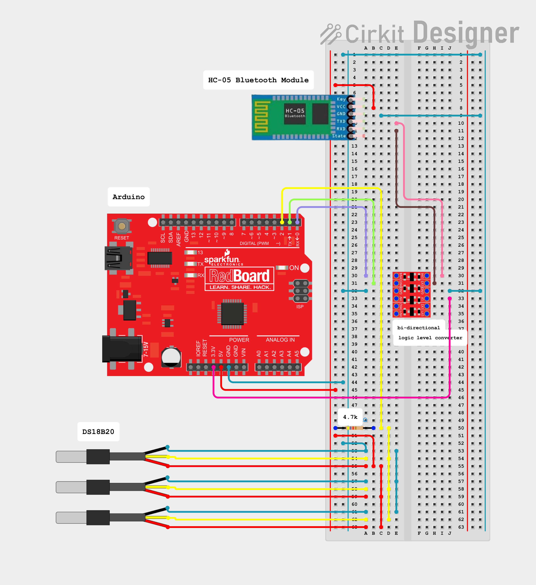
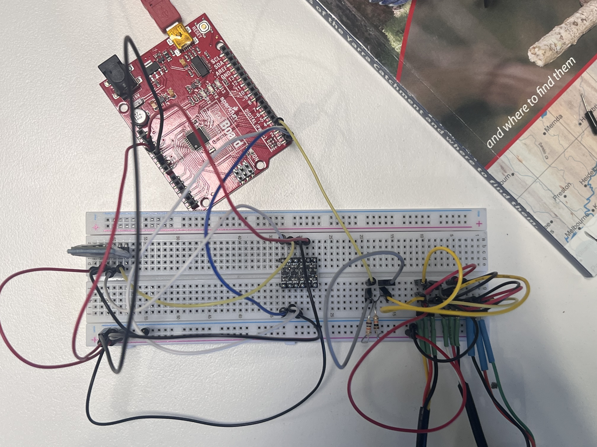

# Dweet for Mutiple sensors on 1 Pin

## Overview
This guide demonstrates how to read multiple DS18B20 temperature sensors on a single Arduino digital pin using the OneWire bus, publish the readings via Bluetooth serial to a Python sender, and then push the data to dweet.cc. It also includes a basic history plotting script (currently showing only temperature1) and guidance on how to extend it to plot multiple series.

  { width="1000" }
  Figure 1: Example schematic wiring for a 5 V Arduino and three DS18B20 temperature sensor in parallel with a pull-up resistor on the data line.


  { width="1000" }
  Figure 2: Example wiring for a 5 V Arduino and three DS18B20 temperature sensor in parallel with a pull-up resistor on the data line.


## System overview
- Arduino reads temperatures from 3× DS18B20 sensors on one pin and prints comma-separated values over Serial every second.
- Python sender (sender.py) reads those CSV lines over a Bluetooth serial port (e.g., /dev/rfcomm0) and dweets them to https://dweet.cc.
- A plotter script fetches historical dweets for the thing name and plots temperature1 vs time (you can later extend it for temperature2 & temperature3).

## Hardware & Wiring
- Arduino
- Sensors: 3 × DS18B20 (in parallel)
- Pull-up resistor: 4.7 kΩ between DATA and VCC (or any resistor close to 4.7kΩ)
- Data Pin: Arduino Digital Pin 2 (configurable in code)
- Connection: Bluetooth serial to host device via HC-05

!!! notes "Key wiring"
    - Connect all DS18B20 data lines together to the same Arduino pin.
    - Ensure common GND between Arduino, Bluetooth module, and sensors.

## Arduino: Read Multiple DS18B20 Sensors on One Pin

=== "c++" 
```cpp
#include <OneWire.h>
#include <DallasTemperature.h>

// Data wire is plugged into digital pin 2 on the Arduino
#define ONE_WIRE_BUS 2

// Setup a oneWire instance to communicate with any OneWire device
OneWire oneWire(ONE_WIRE_BUS);

// Pass oneWire reference to DallasTemperature library
DallasTemperature sensors(&oneWire);

int deviceCount = 0;
float tempC;

void setup(void) {
  sensors.begin();  // Start up the library
  Serial.begin(9600);

  // locate devices on the bus
  Serial.print("Locating devices...");
  Serial.print("Found ");
  deviceCount = sensors.getDeviceCount();
  Serial.print(deviceCount, DEC);
  Serial.println(" devices.");
  Serial.println("");
}

void loop(void) {
  // Send command to all the sensors for temperature conversion
  sensors.requestTemperatures();

  // Display temperature from each sensor
  for (int i = 0; i < deviceCount; i++) {
    tempC = sensors.getTempCByIndex(i);
    Serial.print(tempC);
    if (i< deviceCount-1){
      Serial.print(",");
    }
  }

  Serial.println("");
  delay(1000);
}
```

??? notes "How it works"
    - OneWire Bus: All DS18B20 sensors share one data pin (here, D2 via #define ONE_WIRE_BUS 2). A 4.7 kΩ pull-up resistor from DATA to VCC is required.
    - Library Setup: OneWire handles the low-level bus, while DallasTemperature provides high-level temperature commands.
    - Device Discovery: sensors.getDeviceCount() detects how many sensors are on the bus and stores that number in deviceCount.
    - Measurement Loop:
        - sensors.requestTemperatures() triggers conversions on all sensors.
        - A for loop reads each sensor by index (getTempCByIndex(i)).
        - Values are printed as comma-separated floats followed by a newline, e.g. 23.50,23.69,23.61.
        - A delay(1000) outputs roughly one line per second.
    - Note on Indexing: Index order can change across boots. If you ever need stable labeling (e.g., “Sensor A/B/C”), switch to reading by sensor address (not done here to keep code simple).

## Python Publisher: Read Serial & Dweet (sender.py)

=== "sender.py"
```python
import time
import requests
import serial
from datetime import datetime

import time
import requests
import serial
from datetime import datetime

# ---- CONFIG ----
BASE_THING_NAME = "whittlesea_tech_school"
SERIAL_PORT = "/dev/rfcomm0" 
BAUD_RATE = 9600
POST_URL = f"https://dweet.cc/dweet/for/{BASE_THING_NAME}"
POLL_INTERVAL = 5  # seconds

def parse_temperatures(line: str):
    try:
        return [float(tmp) for tmp in line.strip().split(",")]
    except ValueError:
        return None

def main():
    print(f"Opening serial {SERIAL_PORT} @ {BAUD_RATE}")
    with serial.Serial(SERIAL_PORT, BAUD_RATE, timeout=2) as bt:
        time.sleep(2)  # give Arduino time to reset on open
        print(f"Publishing to {POST_URL}")
        while True:
            try:
                raw = bt.readline().decode("utf-8", errors="ignore")
                temp_c = parse_temperatures(raw)
                print(temp_c)
                if temp_c is None:
                    continue  # skip malformed lines

                # Get current time
                current_time = datetime.now()
                time_string = current_time.isoformat()

                payload = {"temperature1": temp_c[0],
                           "temperature2": temp_c[1],
                           "temperature3": temp_c[2],
                           
                           "time": time_string
                           }
                print(payload)
                r = requests.get(POST_URL, params=payload)
                r.raise_for_status()

                # dweet returns JSON with "with" metadata
                print(f"Sent: {payload} | Response: {r.status_code}")
                time.sleep(POLL_INTERVAL)

            except (serial.SerialException, requests.RequestException) as e:
                print(f"Warning: {e}. Retrying in 5s...")
                time.sleep(5)
            except KeyboardInterrupt:
                print("Exiting.")
                break

if __name__ == "__main__":
    main()
```
??? notes "How it works"
    - Serial Input: Opens the Bluetooth serial device (/dev/rfcomm0) at 9600 baud, matching the Arduino’s Serial.begin(9600). The 2-second sleep lets Arduino reset.
    - Parsing: Each line read from serial is decoded (utf-8) and passed to parse_temperatures(), which splits by comma and converts to floats.Malformed lines return None and are skipped.
    - Timestamp: Generates an ISO-8601 timestamp (datetime.now().isoformat()) stored as time.
    - Payload & Dweet:
        - Sends a GET request to https://dweet.cc/dweet/for/whittlesea_tech_school.
        - Includes keys: temperature1, temperature2, temperature3, and time.
        - On success, prints the payload and HTTP status code.
    - Retry Logic: If serial or network errors occur, it logs a warning and retries after 5 seconds. Ctrl+C stops the loop gracefully.
    - Thing Privacy: BASE_THING_NAME is public-by-name on dweet.cc. Use a non-obvious name if you want to reduce casual discovery.

## Python Fetch & Plot (currently plots only temperature1)

```python
import requests
import matplotlib.pyplot as plt
import numpy as np
from datetime import datetime
from typing import Tuple

THING_NAME = "whittlesea_tech_school"
BASE_URL = "https://dweet.cc"

def fetch_latest() -> Tuple[float, datetime]:
    url = BASE_URL + f"/get/latest/dweet/for/{THING_NAME}"
    r = requests.get(url)
    r.raise_for_status()
    data = r.json()
    latest = data["with"][0]["content"]["temperature1"]
    time_iso = data["with"][0]["content"]["time"]
    # convert from iso format back to datetime
    time = datetime.fromisoformat(time_iso)
    return latest, time

def plot_history_temperature():
    url = BASE_URL +  f"/get/dweets/for/{THING_NAME}"
    r = requests.get(url, timeout=5)
    r.raise_for_status()
    data = r.json()
    history = data["with"]
    temperatures = []
    dates = []
    for data in history:
       temperatures.append(float(data["content"]["temperature1"]))
       dates.append(datetime.fromisoformat(data["content"]["time"]))
    
    # Create figure and axes
    fig, ax = plt.subplots(figsize=(8, 4))

    # Plot the data
    ax.plot(dates, temperatures)

    #vFormat the x-axis for better readability
    # Automatically format the date labels
    fig.autofmt_xdate() 

    # Add labels and title
    ax.set(xlabel="Time", ylabel="Temperature (C)", title="Time vs temperature plot")

    # Display the plot
    plt.show()
       

if __name__ == "__main__":
    reading = fetch_latest()
    print("Latest reading:", reading)
    plot_history_temperature()
```

??? notes "How it works"
    - Endpoints Used:
        - Latest: GET /get/latest/dweet/for/{THING_NAME} — returns the most recent - dweet; this script extracts content.temperature1 and the custom time.
        - History: GET /get/dweets/for/{THING_NAME} — returns a list under with; the script iterates through it to build arrays.

    - Data Extraction:
        - temperatures: list of temperature1 values from each dweet’s content.
        - dates: list of parsed timestamps from content.time (ISO-8601).

    - Plotting:

        - Uses Matplotlib to plot Temperature 1 vs Time.
        - Calls fig.autofmt_xdate() to make time labels readable.


    - Current Limitation:

        - Only temperature1 is plotted. To visualize all three, you’d parse temperature2 and temperature3 similarly and plot multiple lines on the same axes.