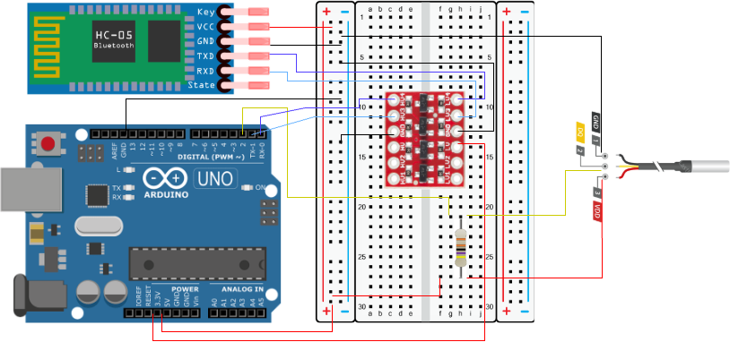

# Data Transfer Through Dweet for one sensor

## Overview
This tutorial shows how to read a DS18B20 temperature sensor with an Arduino (5 V), send the reading over Bluetooth (HC‑05) to a computer, then publish it to dweet.cc and plot the history with Python.

<figure markdown="span">
    { width="1000" }
    <figcaption>Figure 1: HC-05 level-shifted wiring for a 5 V Arduino and temperature sensor (DS18B20).</figcaption>
</figure>

!!! tip "What you’ll build"
    - Arduino prints temperature once per second over serial (via HC‑05).
    - Python sender reads serial and publishes to https://dweet.cc.
    - Python receiver fetches latest/history and plots temperature vs time.

## Hardware Requirements
- Arduino
- DS18B20 temperature sensor
- 4.7 kΩ resistor (pull‑up for the OneWire data line)
- HC‑05 Bluetooth module
- Breadboard + jumper wires

!!! note 
    Refer to section [HC-05 Bluetooth Module Setup](/arduino/HC-05) to implement the Figure 1 circuit

!!! warning
    Due to security reasons the public wifi and school wifi will not work!


## Arduino code


=== "C++"
```cpp
#include <OneWire.h>
#include <DallasTemperature.h>

#define ONE_WIRE_BUS 2
OneWire oneWire(ONE_WIRE_BUS);
DallasTemperature sensors(&oneWire);

void setup() {
Serial.begin(9600);  // hardware serial for HC-05
sensors.begin();
}

void loop() {
sensors.requestTemperatures();
float tempC = sensors.getTempCByIndex(0);
Serial.println(String(tempC, 1));
delay(1000);
}
```

- Uses OneWire and DallasTemperature to read the DS18B20 on D2.
- Prints a single temperature value (e.g., 24.7) every second at 9600 baud.

!!! warning "Upload tip"
    Disconnect HC‑05 TX/RX while uploading the Arduino sketch (they share the hardware serial pins D0/D1).


=== "sender.py"
```python
import time
import requests
import serial
from datetime import datetime

# ---- CONFIG ----
BASE_THING_NAME = "whittlesea_tech_school"
SERIAL_PORT = "/dev/rfcomm0" 
BAUD_RATE = 9600
URL = f"https://dweet.cc/dweet/for/{BASE_THING_NAME}"
POLL_INTERVAL = 5  # seconds

def parse_temperature(line: str):
    # The Arduino prints a number like "24.73"
    try:
        return float(line.strip())
    except ValueError:
        return None

def main():
    print(f"Opening serial {SERIAL_PORT} @ {BAUD_RATE}")
    with serial.Serial(SERIAL_PORT, BAUD_RATE, timeout=2) as bt:
        time.sleep(2)  # give Arduino time to reset on open
        print(f"Publishing to {URL}")
        while True:
            try:
                raw = bt.readline().decode("utf-8", errors="ignore")
                temp_c = parse_temperature(raw)
                if temp_c is None:
                    continue  # skip malformed lines

                # Get current time
                current_time = datetime.now()
                time_string = current_time.isoformat()

                params = {"temperature_c": temp_c,
                           "time": time_string
                           }
                r = requests.get(URL, params=params, timeout=5)
                r.raise_for_status()

                # dweet returns JSON with "with" metadata
                print(f"Sent: {params} | Response: {r.status_code}")
                bt.reset_input_buffer()
                time.sleep(POLL_INTERVAL)

            except (serial.SerialException, requests.RequestException) as e:
                print(f"Warning: {e}. Retrying in 3s...")
                time.sleep(3)
            except KeyboardInterrupt:
                print("Exiting.")
                break

if __name__ == "__main__":
    main()
```
!!! warning "Before Running"

    - Pair the HC‑05 and note the serial port:

    - Windows: COM5 (example)
    - macOS: /dev/tty.HC-05-SerialPort (example)
    - Linux: /dev/rfcomm0 (as shown)

    - Update SERIAL_PORT accordingly.
    (Optional) Make BASE_THING_NAME unique (e.g., whittlesea_tech_school_g01).

Run the script as followed
=== "bash"
```bash
python3 sender.py
```
You should see lines like:
```
Sent: {'temperature_c': 24.6, 'time': '2026-01-27T09:45:02.123456'} | Response: 200
```

=== "reciver.py"
```python
import requests
import matplotlib.pyplot as plt
import numpy as np
from datetime import datetime
from typing import Tuple

THING_NAME = "whittlesea_tech_school"
BASE_URL = "https://dweet.cc"

def fetch_latest() -> Tuple[float, datetime]:
    url = BASE_URL + f"/get/latest/dweet/for/{THING_NAME}"
    r = requests.get(url)
    r.raise_for_status()
    data = r.json()
    latest = data["with"][0]["content"]["temperature_c"]
    time_iso = data["with"][0]["content"]["time"]
    # convert from iso format back to datetime
    time = datetime.fromisoformat(time_iso)
    return latest, time

def plot_history_temperature():
    url = BASE_URL +  f"/get/dweets/for/{THING_NAME}"
    r = requests.get(url, timeout=5)
    r.raise_for_status()
    data = r.json()
    history = data["with"]
    temperatures = []
    dates = []
    for data in history:
       temperatures.append(float(data["content"]["temperature_c"]))
       dates.append(datetime.fromisoformat(data["content"]["time"]))
    
    # Create figure and axes
    fig, ax = plt.subplots(figsize=(8, 4))

    # Plot the data
    ax.plot(dates, temperatures)

    #vFormat the x-axis for better readability
    # Automatically format the date labels
    fig.autofmt_xdate() 

    # Add labels and title
    ax.set(xlabel="Time", ylabel="Temperature (C)", title="Time vs temperature plot")

    # Display the plot
    plt.show()
       
if __name__ == "__main__":
    reading = fetch_latest()
    print("Latest reading:", reading)
    plot_history_temperature()

```
!!! warning "Before Running"
    - Set THING_NAME to match the sender’s BASE_THING_NAME.

Run the script as followed
=== "bash"
```bash
python3 reciver.py
```
You’ll see the latest reading printed and a line chart of recent temperatures.

## Dweet Endpoints (Reference)

Publish
```curl
https://dweet.cc/dweet/for/<THING_NAME>?temperature_c=24.7&time=2026-01-27T09:45:00
```

Get Latest
```curl
https://dweet.cc/get/latest/dweet/for/<THING_NAME>
```

Get History
```curl
https://dweet.cc/get/dweets/for/<THING_NAME>
```

!!! info "Privacy note"
    dweet.cc is public. Use non‑identifying Thing Names and rotate them between classes if needed.